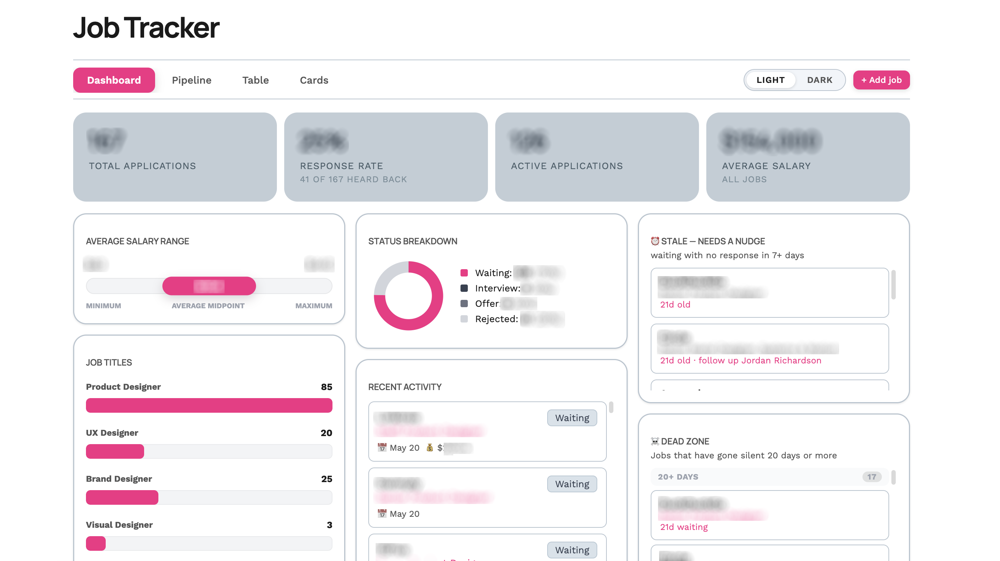
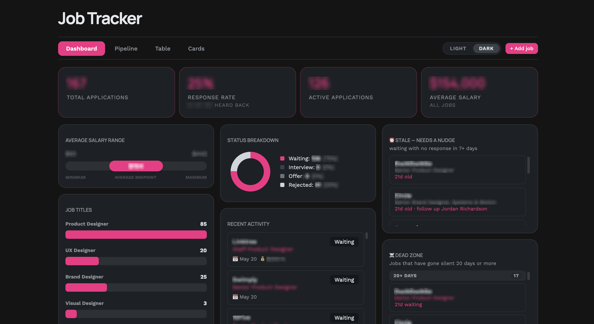
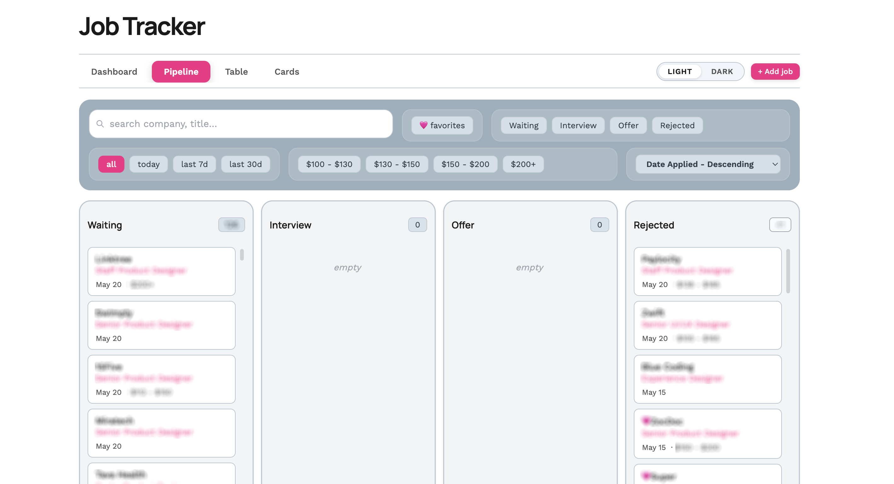
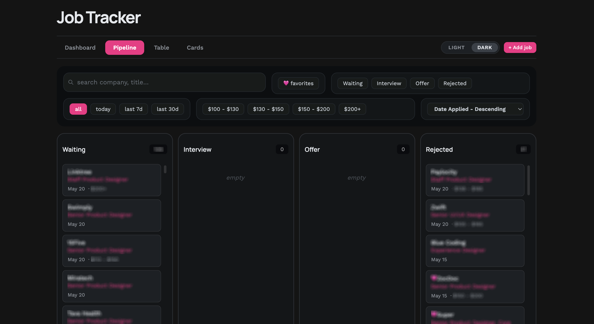
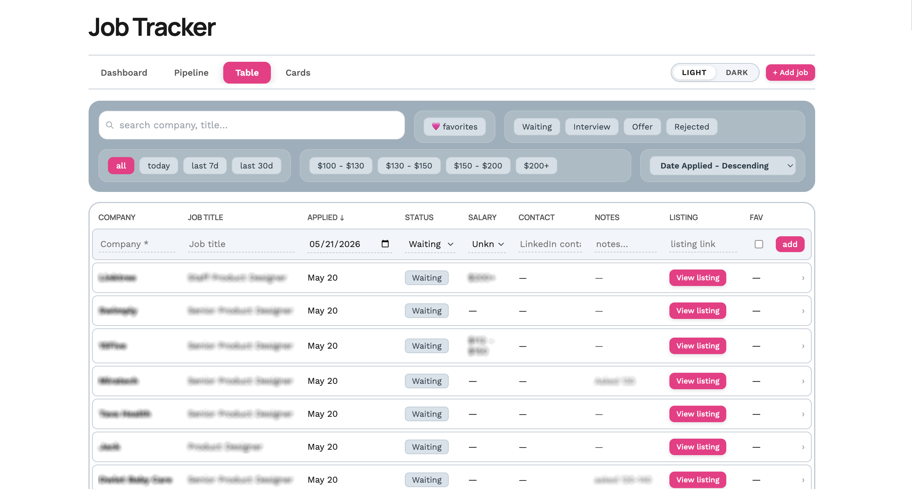
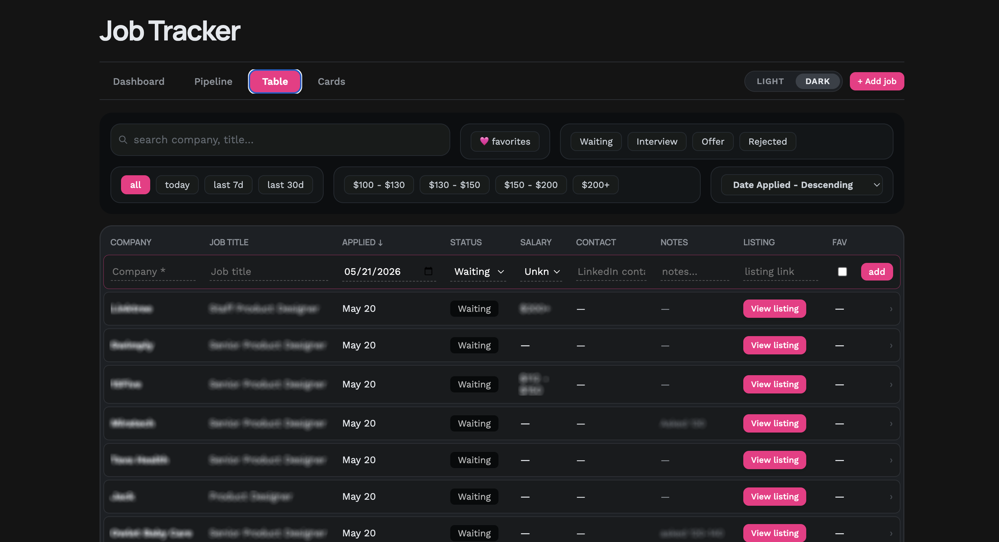
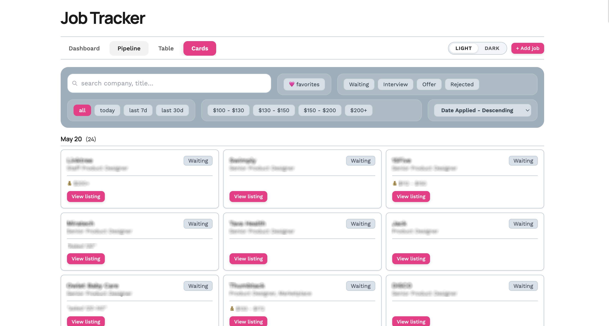
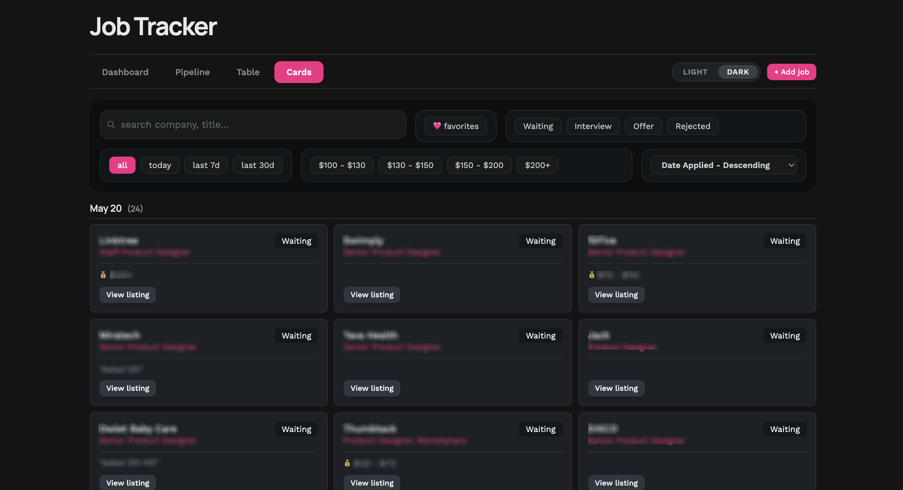
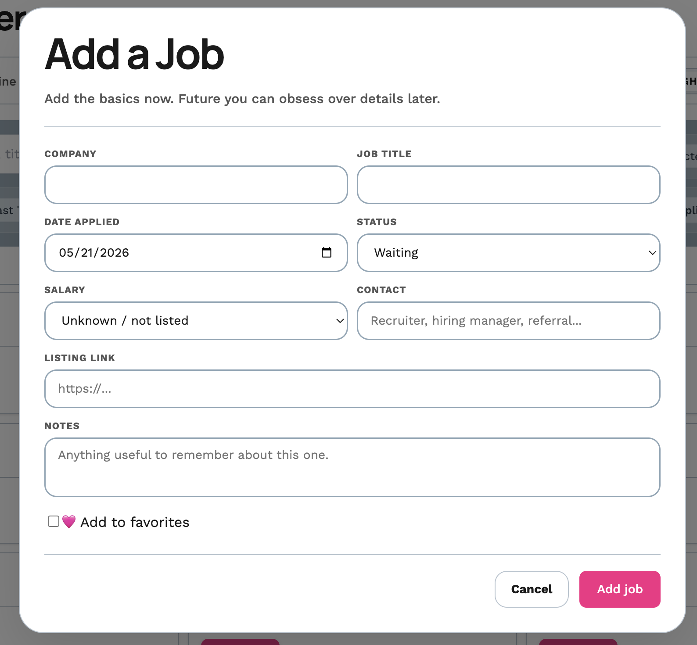
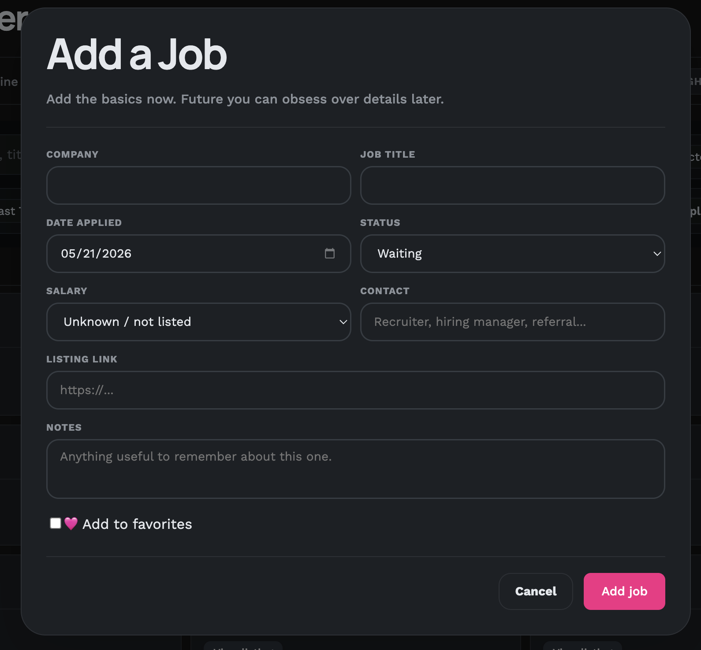

## Screenshots

### Dashboard - Everything you need to scan quickly all in one place

### Pipeline View - Kanban-style cards that drag and drop to change status

### Table View - If you prefer adding information spreadsheet-style

### Card View - For easy sorting and quick overviews

### Add Job - with auto-fill roles from previous entries and pre-filled dropdowns

