# Appliclick

Track every application without the spreadsheet chaos.

Appliclick is a job search management platform I designed and built after getting buried under tabs, spreadsheets, follow-up reminders, recruiter messages, salary ranges, portfolio versions, and application statuses during my own job search.

What started as a personal survival tool quickly exposed a larger UX problem.

Most job trackers are either rigid spreadsheet clones, overly corporate CRM tools, visually overwhelming, or emotionally exhausting to use every day.

Appliclick was designed to reduce cognitive load during one of the most stressful workflows people go through.

This project became a full product design exercise focused on workflow clarity, emotional UX, scalable organization, responsive interaction patterns, and rapid iteration from real-world usage.

- This repository contains an earlier personal prototype and wireframing version of the project. The current production version, including the latest features, architecture, and database implementation, remains private.

 

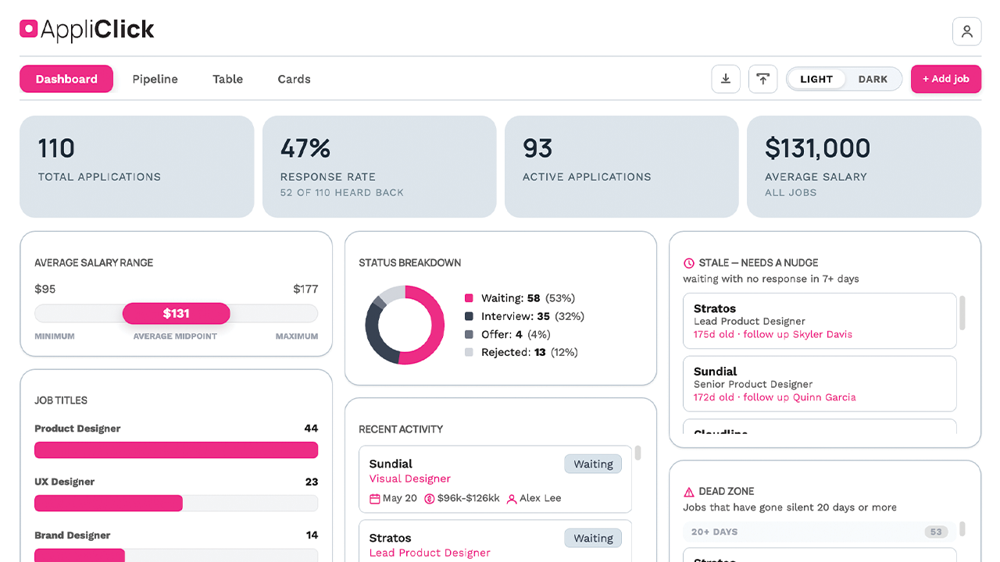

  

# The Problem

Job searching creates fragmented mental overhead.

Applications live across LinkedIn, Greenhouse, Lever, Gmail, recruiter messages, PDFs, resumes, notes apps, salary spreadsheets, calendars, and browser tabs.

After enough applications, the process becomes difficult to mentally manage.

Which companies ghosted?

Which roles need follow-up?

Which resume version was used?

Which applications are still active?

Which jobs are worth emotional energy?

Which ones are already dead?

I originally built Appliclick because I was experiencing this problem myself in real time.

The goal was not just to track applications.

The goal was to reduce anxiety through better organization, visibility, hierarchy, and interaction design.

 

# My Role

End-to-end product design and development.

I defined the product direction, designed the interaction model, built the UI system, structured the information architecture, created responsive layouts, implemented the frontend, iterated on UX through daily personal usage, refined workflows based on real friction points, and handled deployment and database integration.

This was not a static mockup project.

It became a functioning product used daily during my own active job search.

 

# Design Goals

## Reduce cognitive overload

The interface prioritizes fast scanning, clear hierarchy, and minimal friction when reviewing dozens or hundreds of active opportunities.

## Support different mental models

Some users think in spreadsheets.

Some think visually.

Some think in workflow stages.

Instead of forcing a single organizational system, Appliclick supports multiple interchangeable views for the same data.

## Make stressful workflows feel manageable

The product intentionally avoids dense enterprise UI patterns in favor of calmer spacing, clearer prioritization, and emotionally aware labeling.

Features like Needs a Nudge, Dead Zone, status visibility, recent activity, and dashboard summaries were designed to reduce ambiguity during long hiring cycles.

## Build fast and iterate from real use

Because I was actively using the product every day, friction surfaced quickly and led directly into redesigns and workflow improvements.

 

# Landing Experience

The logged-out experience focuses on clarity, emotional reassurance, and reducing intimidation during onboarding.

Rather than positioning the product as another productivity dashboard, the messaging focuses on reducing stress and restoring visibility during the hiring process.

 

## Homepage

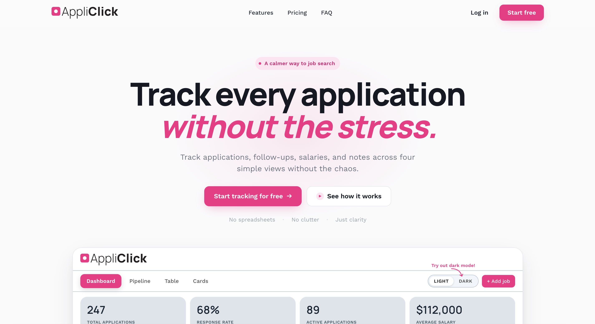

 

## Organization and workflow messaging

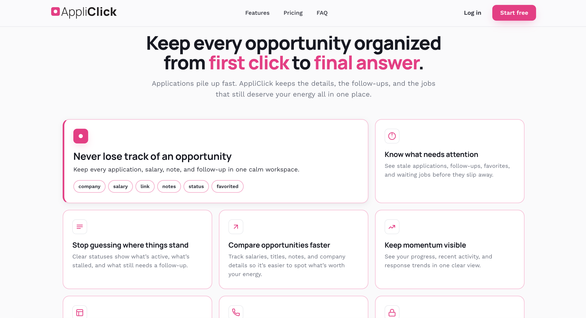

 

## Flexible views and workflow adaptation

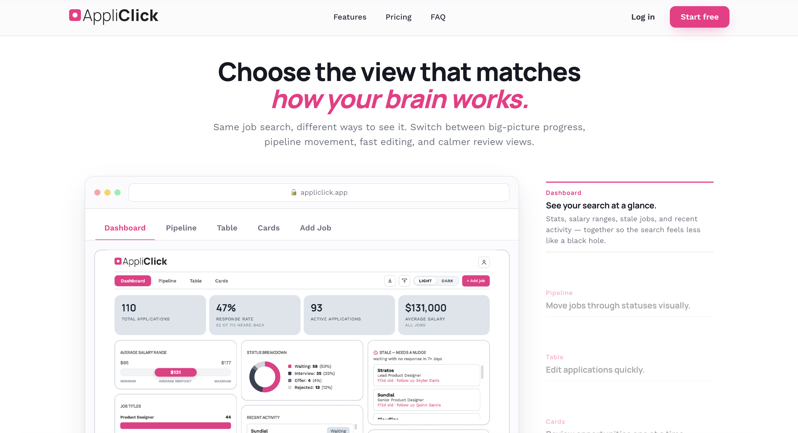

 

## Pricing and conversion flow

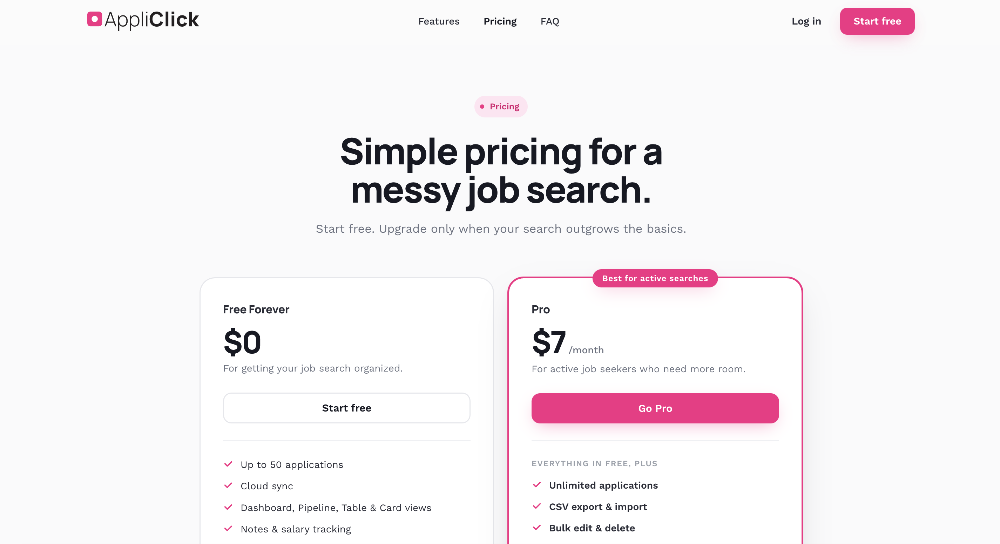

  

# Dashboard

The dashboard was designed to answer the most important questions immediately.

How many active opportunities still exist?

What is actually progressing?

What salary ranges am I targeting?

Which companies need follow-up?

Which applications are likely dead?

How healthy is the pipeline overall?

The challenge was balancing dense information without creating visual exhaustion.

I focused heavily on hierarchy, scanability, spacing, grouping, emotional clarity, responsive behavior, and quick-glance metrics.

 

## Dark Mode

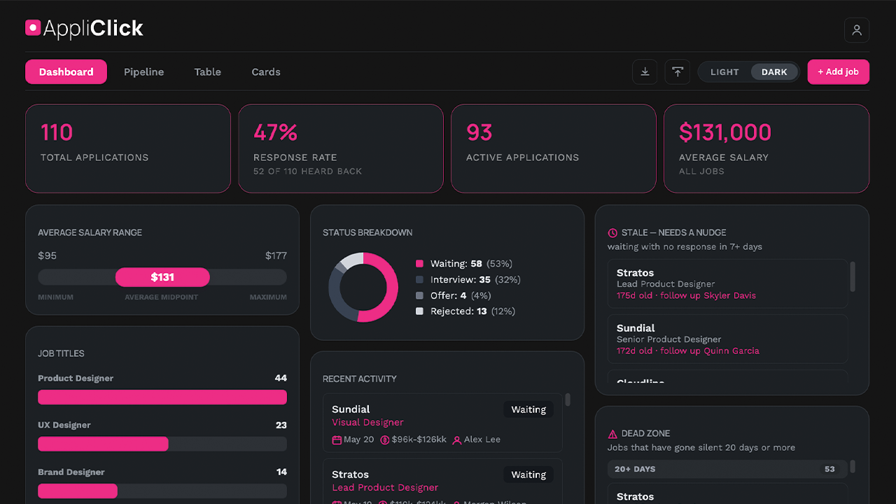

 

## Light Mode

  

# Pipeline View

The pipeline view was designed for users who think spatially and process progress visually.

Applications can be dragged between stages with a kanban-style interaction model, allowing rapid status updates without opening detailed forms.

One major challenge was preventing the interface from becoming visually noisy once columns filled with large numbers of cards.

This led to multiple iterations around card density, spacing, overflow behavior, drag targets, hierarchy, and responsive stacking.

 

## Dark Mode

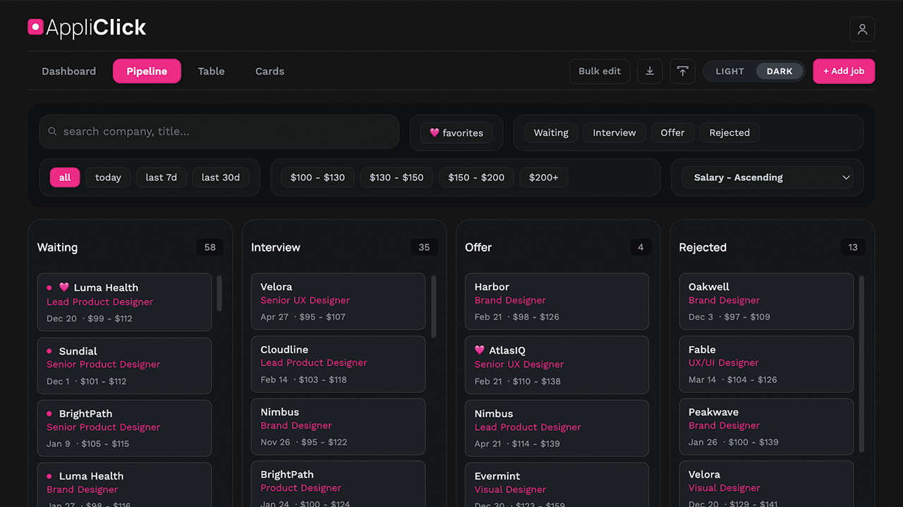

 

## Light Mode

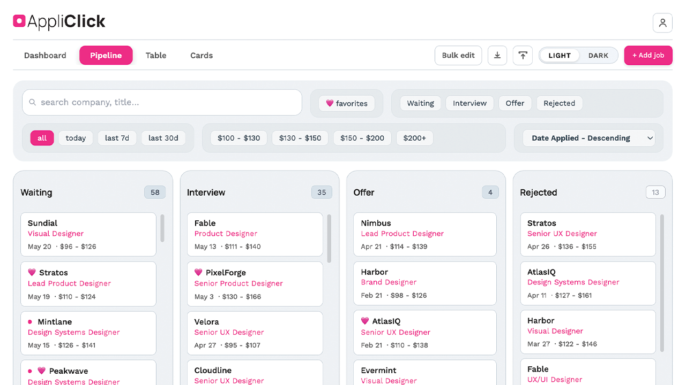

  

# Table View

Some workflows still work best in structured rows.

The table view was designed for fast high-volume editing with spreadsheet-style interaction patterns while still maintaining readability and hierarchy.

This became especially important once application counts passed 100+ entries.

The challenge here was balancing data density, readability, filtering, responsive behavior, edit speed, and visual fatigue.

 

## Dark Mode

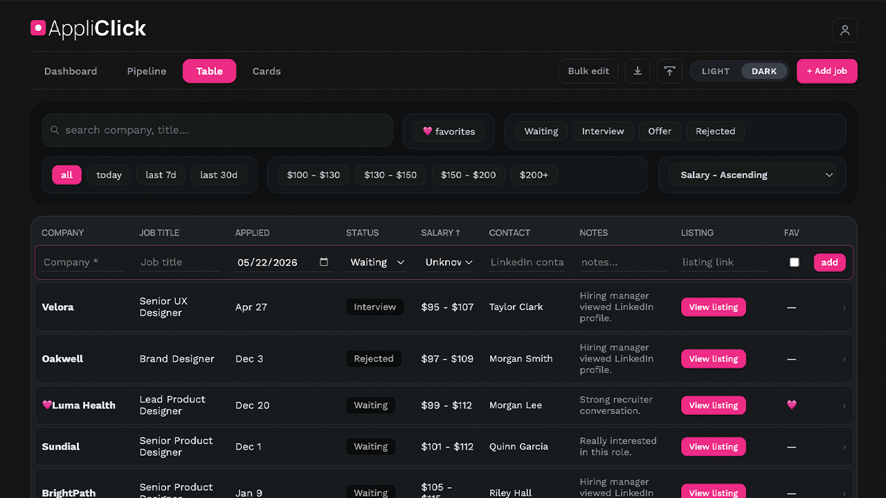

 

## Light Mode

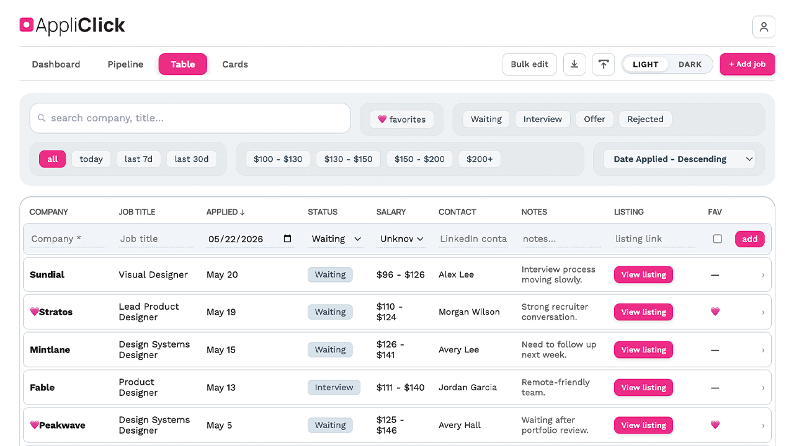

  

# Card View

The card view focuses on quick scanning, sorting, and lightweight browsing.

This mode was designed for users who want more context than a spreadsheet provides without the heavier structure of kanban workflows.

Cards prioritize role visibility, company recognition, salary visibility, status clarity, note access, and fast scanning.

 

## Dark Mode

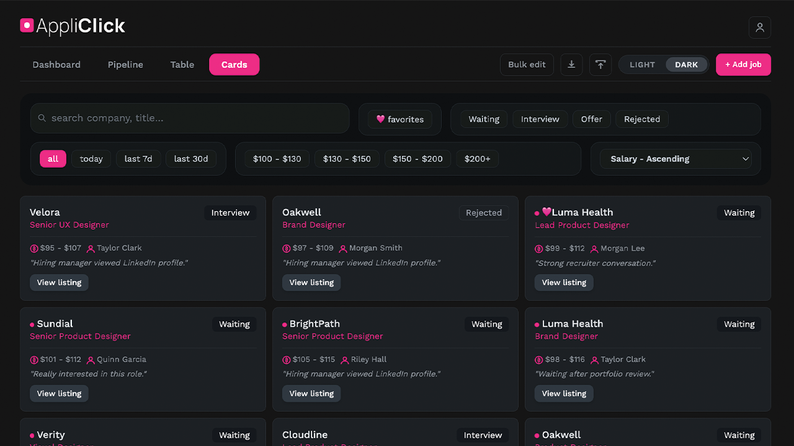

 

## Light Mode

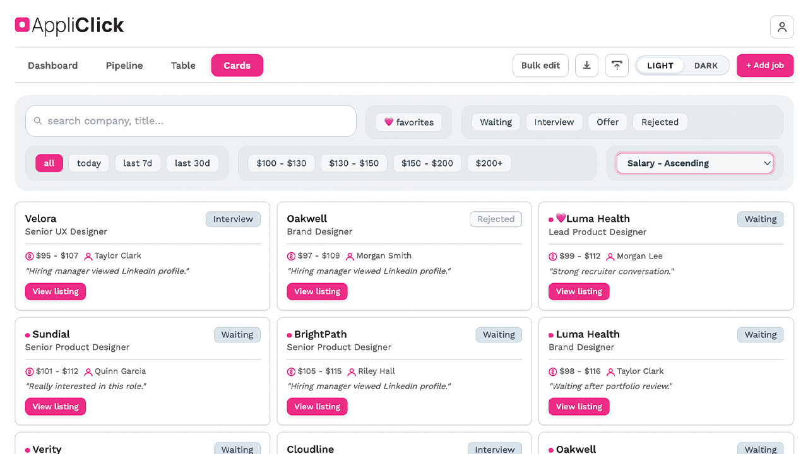

  

# Add Job Flow

The add flow was optimized for speed because repetitive data entry becomes frustrating extremely quickly during active application periods.

The experience includes reusable role suggestions, pre-filled dropdowns, fast keyboard-friendly entry, simplified hierarchy, and minimized friction.

This flow went through multiple revisions after daily use exposed repetitive interaction pain points.

 

## Dark Mode

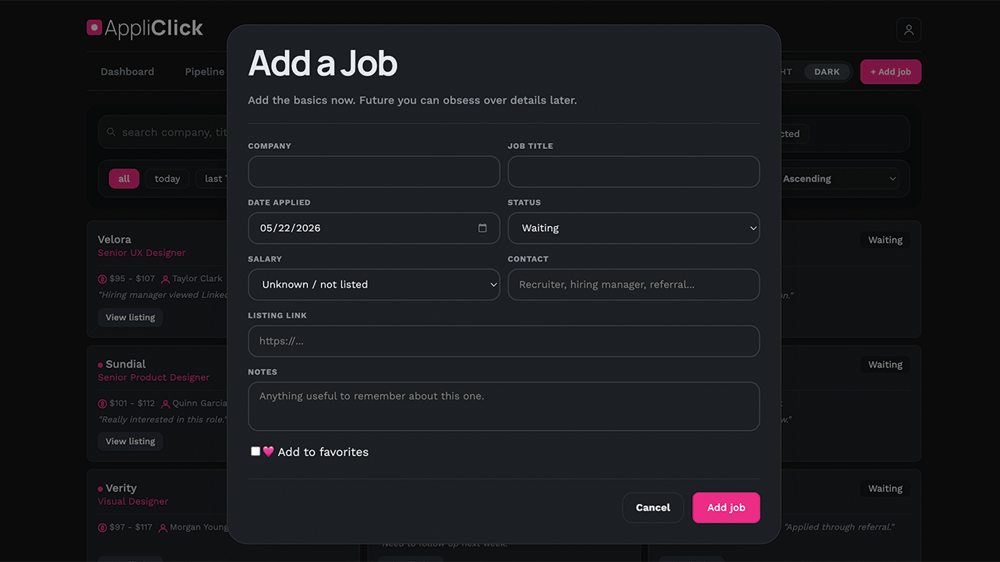

 

## Light Mode

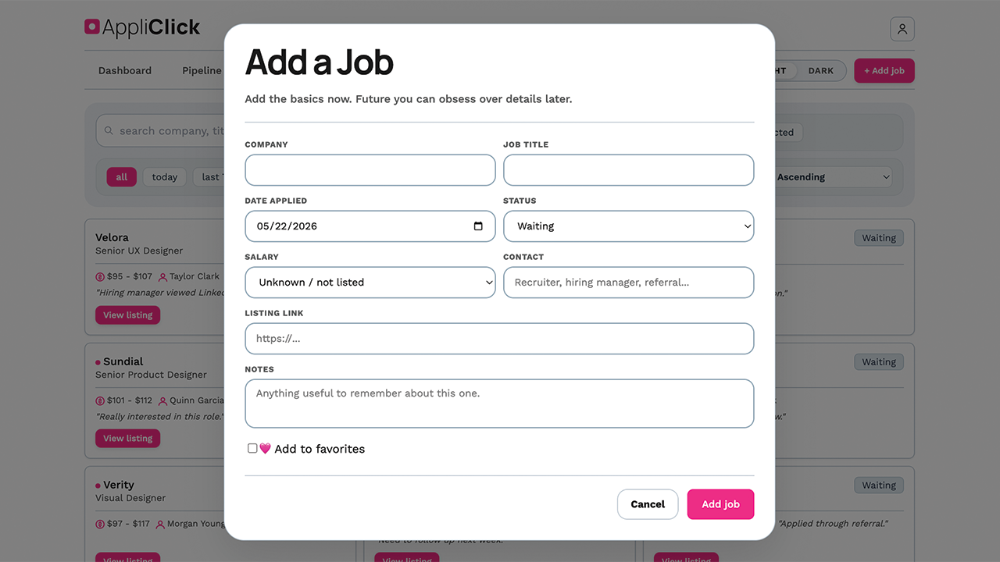

  

# Technical Approach

Appliclick was built using React, JavaScript, HTML, CSS, Supabase, Cloudflare, and AI-assisted prototyping workflows.

The project started as a rapid prototype and evolved into a significantly more refined system through iterative redesigns, restructuring, and usability improvements.

AI tools accelerated implementation speed, but the core product thinking, workflow architecture, interaction design, prioritization, and refinement decisions were driven manually through real-world usage and iteration.

 

# What I Learned

This project fundamentally changed how I think about product design.

Building and using my own product daily exposed problems that static mockups never reveal.

Interaction fatigue.

Workflow bottlenecks.

Hierarchy failures.

Emotional friction.

Scaling issues.

Responsiveness under real data volume.

Repeated-action frustration.

Dashboard overload.

It also pushed me to work much closer to implementation than I had previously, rapidly iterating between UX decisions, visual systems, frontend behavior, data structure, interaction refinement, and usability testing.

Most importantly, it reinforced something I care deeply about as a designer.

Good product design is not just making software usable.

It is reducing mental strain during stressful human experiences.
