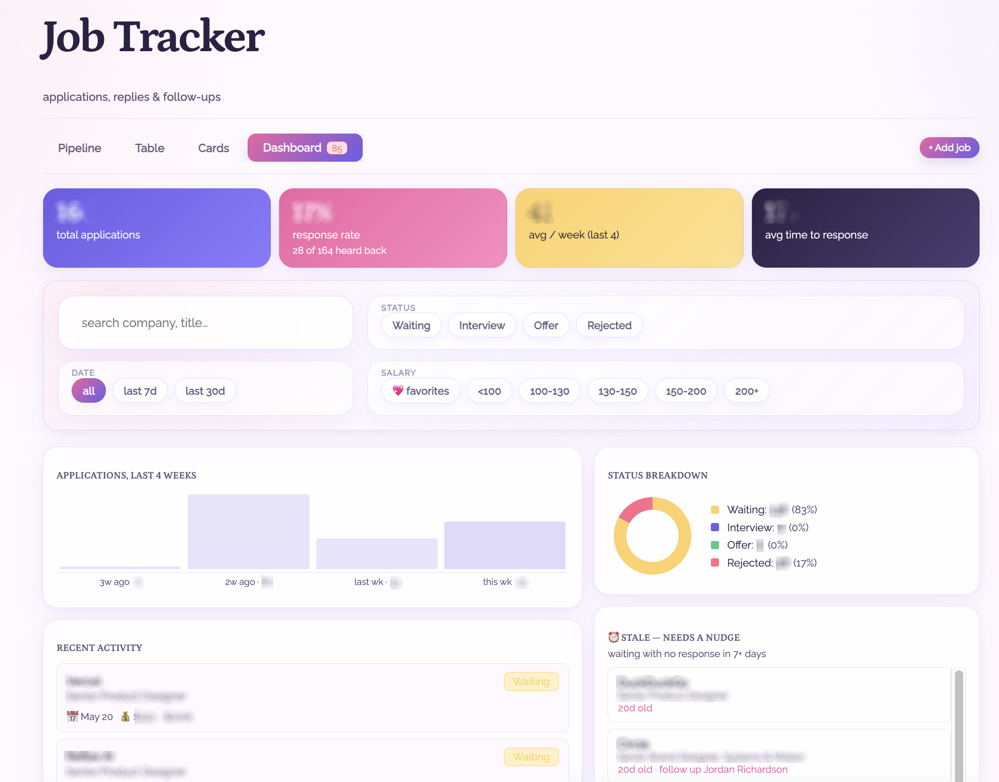
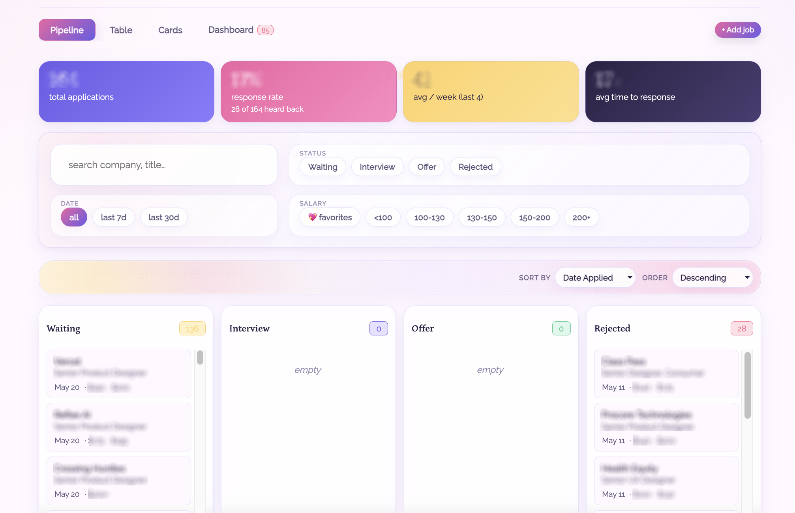
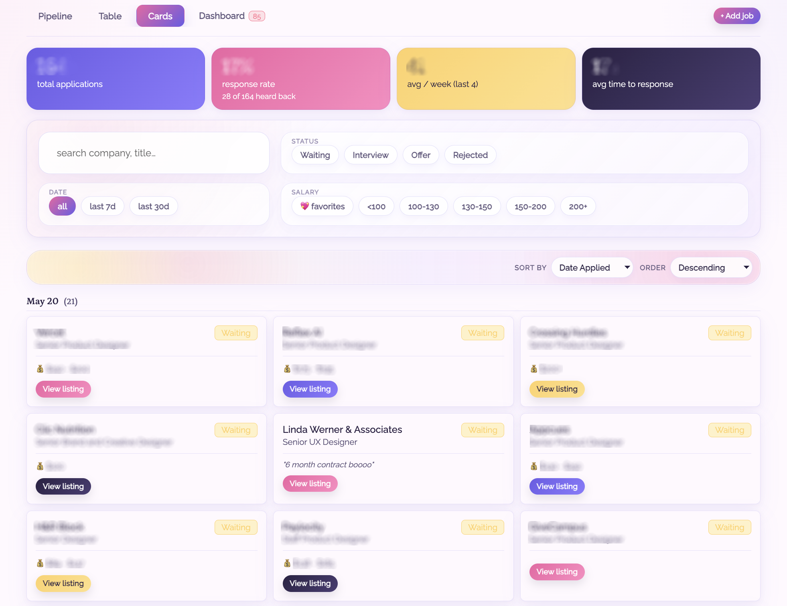
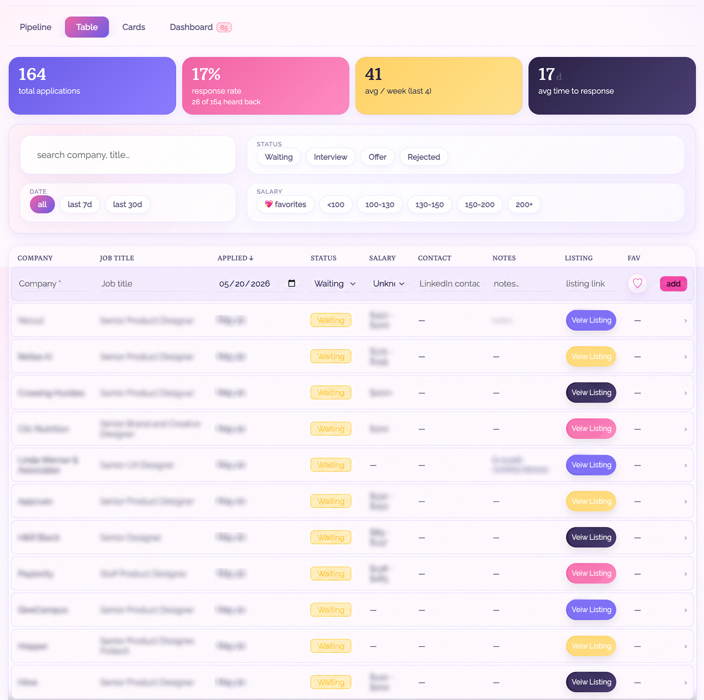
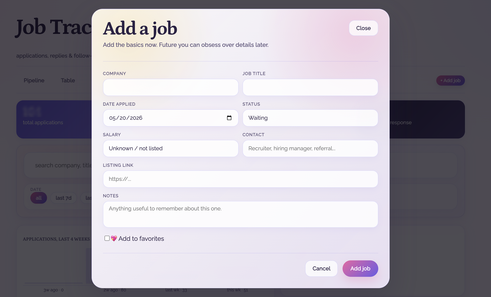

# Job Tracker

A personal job application tracker I built to keep my job search organized.

It tracks each application, company, role, status, dates, notes, salary info, and follow-up reminders. It also includes a dashboard so I can quickly see overall stats, progress, patterns, and where each opportunity stands.

This started as a simple personal workflow tool and became a small AI-assisted prototype project. I used it to practice moving quickly from a real problem into a working browser-based app.

## Screenshots

### Dashboard

### Pipeline View - Movable Kanban-Style Cards

### Card View - Great for Date Ranges

### Table View - Can Add Jobs Via Table

### Add Job Pop Up Screen with Auto-Fill Job Titles

## What it does

Tracks job applications and current status  
Shows overall application stats in a dashboard  
Supports table, card, and pipeline views  
Opens a detail drawer for editing applications  
Saves data locally in the browser  
Runs as a static site with no build step  

## Why I built it

I needed a better way to manage my own job search without relying on a spreadsheet. I wanted something simple, visual, and fast that could help me track applications, see patterns, and stay organized.

## Tools used

- HTML, CSS, React, and JavaScript for the code  
- Vercel v0 for the initial design and prototype  
- ChatGPT, Claude, and VS Code for later manual code edits  
- Cloudflare and Supabase for deployment and cloud data storage  

## What I learned

This helped me become faster and more efficient with rapid prototyping, local data storage, component organization, and using AI as part of a practical design and build workflow. It also helped me think through how dashboards and status-based tools can reduce mental load when a process has a lot of moving pieces.
